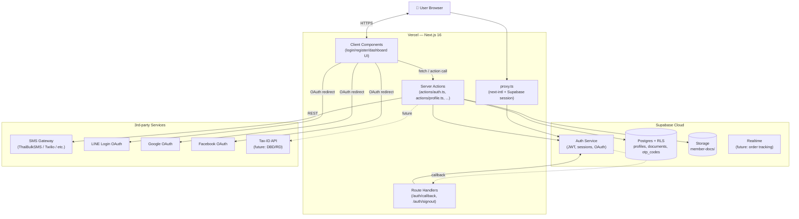
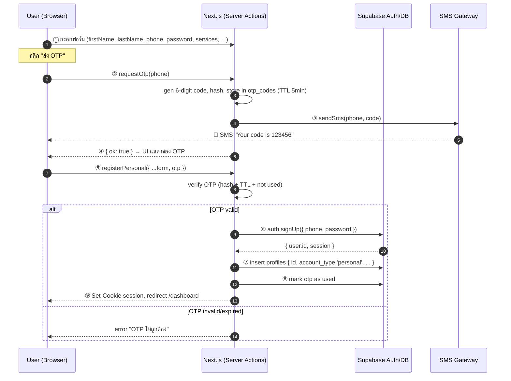
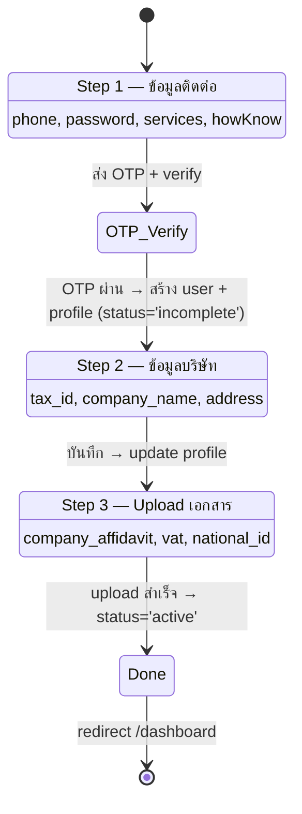
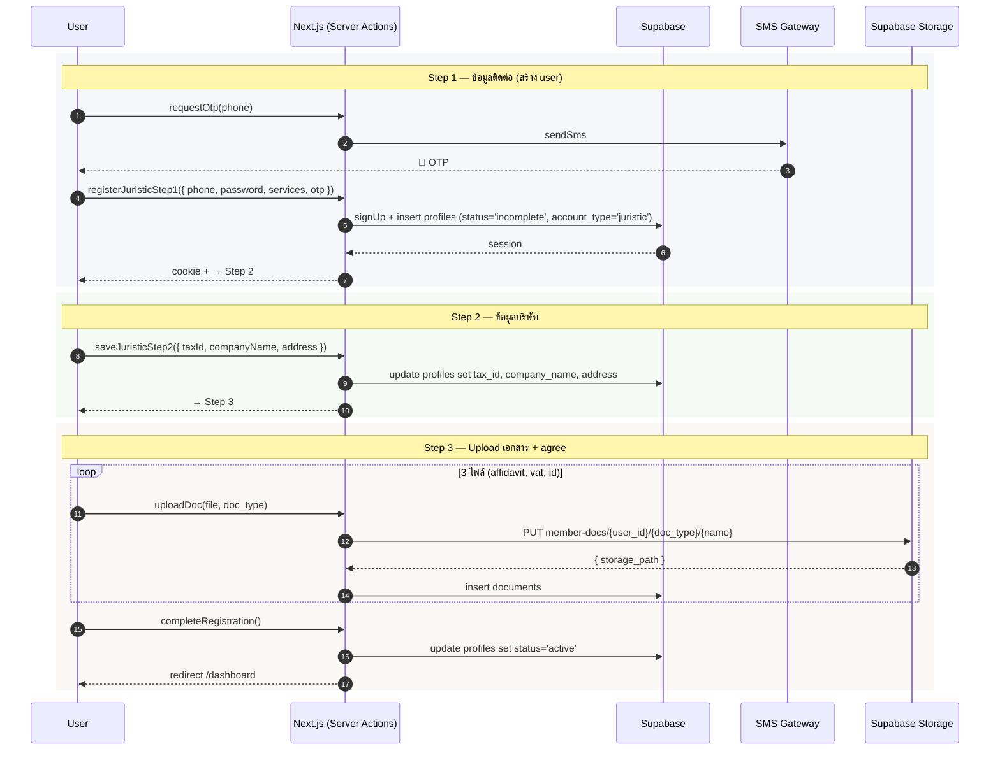
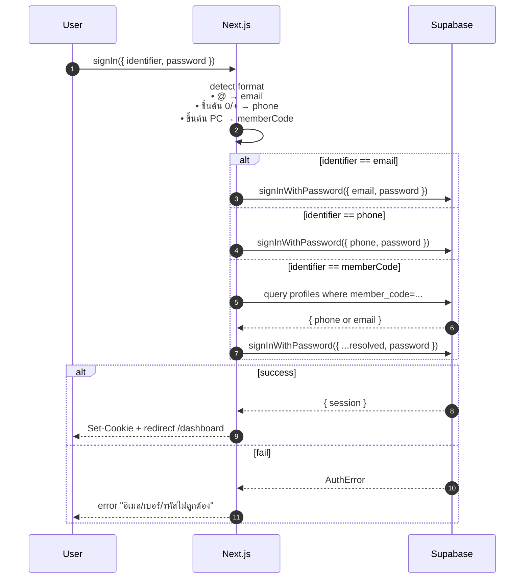
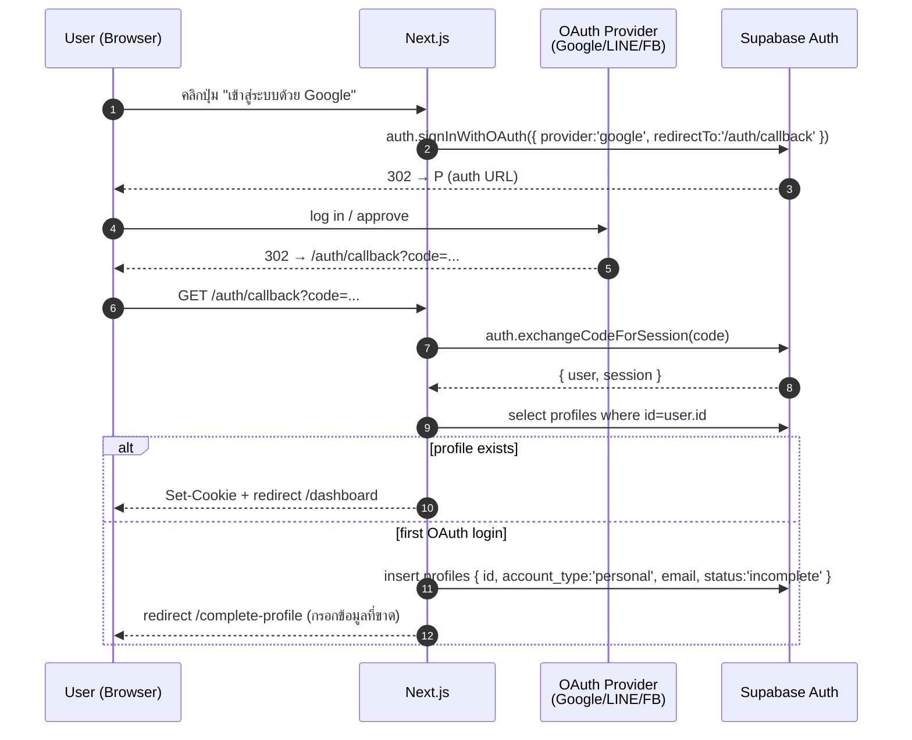
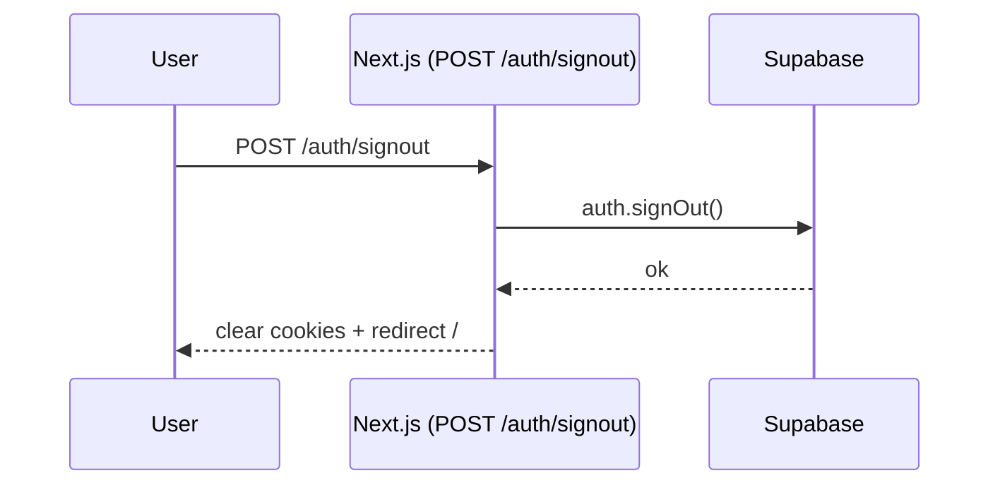
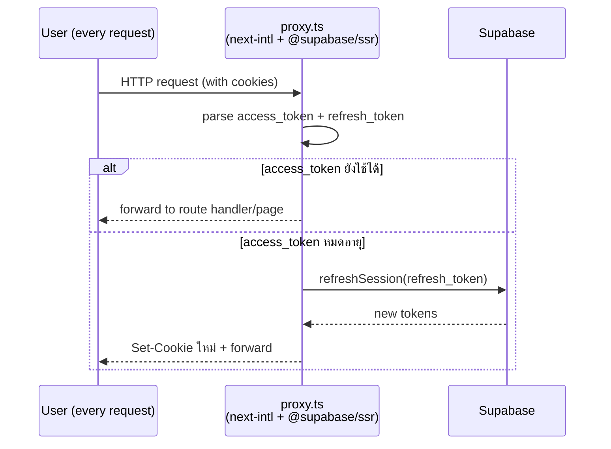
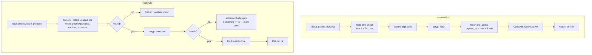

# Pacred — Auth & Backend Architecture

> สถาปัตยกรรมระบบ login/register และ backend สำหรับ Pacred-web
> ใช้เป็น **blueprint** ก่อนเริ่ม implement (ทุก flow + diagram + schema อยู่ในนี้)

---

## 1. Decisions Summary

| หัวข้อ | ตัดสินใจ | หมายเหตุ |
|---|---|---|
| **Hosting** | Vercel (web) + Supabase Cloud (BaaS) | edge runtime, CI/CD ผ่าน Git |
| **Auth Provider** | Supabase Auth | email/password + OAuth |
| **OTP — SMS** | 3rd-party SMS gateway (custom) | ไม่ใช้ Twilio ของ Supabase |
| **OAuth Providers** | Google, Facebook, LINE | LINE = custom OIDC ผ่าน LINE Login Channel |
| **Database** | Supabase Postgres + RLS | schema + policies จัดการที่ Supabase |
| **File Storage** | Supabase Storage (private bucket) | สำหรับเอกสารนิติบุคคล |
| **Backend logic** | Next.js Server Actions / Route Handlers | ไม่มี backend service แยก |
| **Tax-ID lookup** | Future (Phase 6+) | manual ก่อน |

---

## 2. High-Level Architecture



---

## 3. Tech Stack

```
┌────────────────────────────────────────────┐
│ Frontend                                    │
│  • Next.js 16.2.6 (App Router, RSC)        │
│  • React 19.2.4                            │
│  • TypeScript (strict)                     │
│  • Tailwind v4                             │
│  • next-intl (i18n: th/en)                 │
│  • next-themes (light/dark)                │
│  • lucide-react (icons)                    │
├────────────────────────────────────────────┤
│ Backend (อยู่ใน Next.js เอง)                │
│  • Server Actions (mutations + business)   │
│  • Route Handlers (webhooks, OAuth cb)     │
│  • Middleware (proxy.ts: i18n + session)   │
│  • Zod (validation)                        │
├────────────────────────────────────────────┤
│ Data Layer                                  │
│  • @supabase/supabase-js                   │
│  • @supabase/ssr (cookie-based session)    │
│  • Supabase Auth (JWT)                     │
│  • Supabase Postgres + RLS                 │
│  • Supabase Storage (private bucket)       │
├────────────────────────────────────────────┤
│ External Services                           │
│  • SMS Gateway (TBD)                       │
│  • LINE Login (OAuth/OIDC)                 │
│  • Google OAuth                            │
│  • Facebook OAuth                          │
│  • DBD/RD (future, Tax-ID lookup)          │
└────────────────────────────────────────────┘
```

---

## 4. Folder Structure (Target)

```
pacred-web/
├─ app/
│  └─ [locale]/
│     ├─ (public)/                  # ไม่ต้อง login
│     │  ├─ page.tsx                # home
│     │  ├─ login/page.tsx
│     │  └─ register/page.tsx
│     ├─ (protected)/               # require login
│     │  ├─ layout.tsx              # auth guard
│     │  ├─ dashboard/page.tsx
│     │  ├─ profile/page.tsx
│     │  └─ orders/page.tsx         # (future)
│     ├─ auth/
│     │  ├─ callback/route.ts       # OAuth callback
│     │  └─ signout/route.ts        # POST signout
│     ├─ layout.tsx
│     └─ ...
│
├─ actions/                          # Server Actions (mutations)
│  ├─ auth.ts                       # signIn, signOut, registerPersonal, ...
│  ├─ otp.ts                        # requestOtp, verifyOtp
│  ├─ profile.ts                    # updateProfile, uploadDoc
│  └─ orders.ts                     # (future)
│
├─ lib/
│  ├─ supabase/
│  │  ├─ client.ts                  # browser client (anon key)
│  │  ├─ server.ts                  # server client (read cookies)
│  │  └─ admin.ts                   # service-role (server-only)
│  ├─ auth/
│  │  ├─ get-user.ts                # current user helper
│  │  └─ require-auth.ts            # redirect ถ้าไม่ login
│  ├─ sms/
│  │  └─ gateway.ts                 # 3rd-party SMS adapter
│  └─ validators/                   # Zod schemas
│     ├─ auth.ts
│     └─ profile.ts
│
├─ types/
│  └─ db.ts                          # auto-generated from Supabase
│
├─ components/                       # (เดิม)
├─ messages/ th.json en.json         # (เดิม)
├─ i18n/                             # (เดิม)
├─ proxy.ts                          # middleware (i18n + session refresh)
├─ docs/
│  └─ architecture.md                # ไฟล์นี้
└─ .env.local                        # (gitignored)
```

---

## 5. Database Schema (ER Diagram)

```mermaid
erDiagram
  AUTH_USERS ||--|| PROFILES : "1:1 (id)"
  PROFILES ||--o{ DOCUMENTS : "1:N"
  PROFILES ||--o{ OTP_CODES : "1:N"

  AUTH_USERS {
    uuid id PK
    text email
    text phone
    timestamptz created_at
    text role
  }

  PROFILES {
    uuid id PK_FK
    text account_type "personal | juristic"
    text member_code "PR001, PR002 ..."
    text first_name
    text last_name
    text phone
    text email
    text[] services
    text how_know
    text tax_id "juristic only"
    text company_name "juristic only"
    jsonb address "juristic only"
    text status "incomplete | active | suspended"
    timestamptz created_at
    timestamptz updated_at
  }

  DOCUMENTS {
    uuid id PK
    uuid profile_id FK
    text doc_type "company_affidavit | vat | national_id"
    text storage_path
    text mime_type
    int size_bytes
    timestamptz uploaded_at
  }

  OTP_CODES {
    uuid id PK
    text phone
    text code_hash
    text purpose "register | login | reset"
    timestamptz expires_at
    boolean used
    timestamptz created_at
  }
```

### Row-Level Security (RLS) policies

| Table | Policy | Rule |
|---|---|---|
| `profiles` | self-rw | `auth.uid() = id` |
| `documents` | self-rw | `auth.uid() = (select profile_id from documents)` |
| `otp_codes` | server-only | RLS = no public access; only service-role client เขียน/อ่าน |

### Storage bucket
- **Bucket name:** `member-docs` (private)
- **Path pattern:** `{user_id}/{doc_type}/{filename}`
- **Policy:** อ่าน/เขียน เฉพาะ folder ที่ตรงกับ `auth.uid()`

---

## 6. Auth Flows

### 6.1 Sign Up — Personal (Phone + Password + OTP via 3rd-party SMS)



---

### 6.2 Sign Up — Juristic (3-step Wizard)





---

### 6.3 Sign In — Email/Phone/MemberCode + Password



---

### 6.4 Sign In — OAuth (Google / LINE / Facebook)



---

### 6.5 Sign Out



---

### 6.6 Session Refresh (Middleware)



---

## 7. OTP Flow Detail (3rd-party SMS)

> ใช้ custom logic — ไม่ผูก Supabase phone auth

### 7.1 Tables

```sql
create table public.otp_codes (
  id uuid primary key default gen_random_uuid(),
  phone text not null,
  code_hash text not null,           -- bcrypt of 6-digit code
  purpose text not null check (purpose in ('register','login','reset')),
  expires_at timestamptz not null,
  used boolean default false,
  attempts int default 0,
  created_at timestamptz default now()
);

create index on otp_codes (phone, purpose, used);
```

### 7.2 Server Actions



### 7.3 SMS Gateway abstraction

`lib/sms/gateway.ts` — interface ที่เปลี่ยน provider ได้ง่าย:

```ts
export interface SmsGateway {
  send(phone: string, message: string): Promise<{ ok: boolean; messageId?: string }>;
}

// Implementation chosen via env: SMS_PROVIDER=thaibulksms | twilio | dummy
```

---

## 8. Security Model

### 8.1 Three Supabase clients

| Client | ใช้ที่ไหน | Key |
|---|---|---|
| `lib/supabase/client.ts` | "use client" components | `NEXT_PUBLIC_SUPABASE_ANON_KEY` |
| `lib/supabase/server.ts` | Server Components, Server Actions, Route Handlers | anon key + cookies (มี RLS) |
| `lib/supabase/admin.ts` | Server-only, **bypass RLS** | `SUPABASE_SERVICE_ROLE_KEY` (ห้าม leak) |

### 8.2 ทุก mutation ผ่าน Server Action (ไม่ใช่ client)
- ✅ Validate input ที่ server (Zod)
- ✅ ไม่เผย service-role key ให้ client
- ✅ RLS ป้องกันการอ่าน/เขียนข้ามผู้ใช้

### 8.3 Env vars
```
NEXT_PUBLIC_SUPABASE_URL=
NEXT_PUBLIC_SUPABASE_ANON_KEY=
SUPABASE_SERVICE_ROLE_KEY=        # server only — ห้าม commit / ห้ามส่งให้ client
SMS_PROVIDER=
SMS_API_KEY=
SMS_API_SECRET=
LINE_OAUTH_CLIENT_ID=             # สำหรับ Supabase LINE provider config
LINE_OAUTH_CLIENT_SECRET=
SITE_URL=https://pacred.com       # สำหรับ OAuth redirect
```

### 8.4 Rate limiting
- OTP request: max 3 ครั้ง/ชม./เบอร์
- Login: max 10 ครั้ง/15 นาที/IP (ผ่าน Vercel Edge Config หรือ Upstash Redis)

---

## 9. Future Systems Pattern

เมื่อจะเพิ่ม feature ใหม่ (เช่น orders, tracking, pricing-calculator) → ทำตาม pattern นี้ทุกครั้ง:

```mermaid
flowchart LR
  A[1. เพิ่ม table<br/>+ RLS policy<br/>ที่ Supabase] --> B[2. Generate types<br/>npx supabase gen types ts]
  B --> C[3. เขียน Zod schema<br/>lib/validators/]
  C --> D[4. เขียน Server Actions<br/>actions/feature.ts]
  D --> E[5. UI ที่<br/>app/[locale]/(protected)/feature/]
  E --> F[6. Realtime sub<br/>ใน 'use client' ถ้าต้องการ]
```

### ตัวอย่าง: ระบบ Orders (เมื่อพร้อม)
```
Schema:           orders, order_items, shipments
Validators:       lib/validators/orders.ts
Server Actions:   actions/orders.ts → createOrder, listOrders, cancelOrder
Pages:            app/[locale]/(protected)/orders/{page,[id]/page}.tsx
Realtime:         shipment status updates ผ่าน supabase.channel('shipments')
```

---

## 10. Implementation Roadmap (จาก plan แม่)

| Phase | งาน | เวลา | หลังทำเสร็จต้องเช็ค |
|---|---|---|---|
| **1** | Setup Supabase + ติดตั้ง package + 3 client helpers + .env | ~30m | `pnpm dev` ไม่ error, import client ได้ |
| **2** | Auth foundation: SQL schema + RLS + Storage bucket + middleware + callback handler | ~1.5h | เห็น tables ใน Supabase, session refresh ทำงาน |
| **3** | เชื่อม UI: login + register (personal + juristic 3-step) + OAuth + OTP via SMS gateway | ~3h | สมัคร→login→เห็นใน auth.users + profiles + storage |
| **4** | Protected routes + middleware redirect + NavBar user menu | ~45m | /dashboard redirect ถ้าไม่ login, แสดง avatar |
| **5** | Folder pattern เตรียม future systems + dummy orders flow | ~30m | สร้าง dummy CRUD ทำงานได้ end-to-end |

---

## Appendix A — `proxy.ts` (Middleware)

```mermaid
flowchart TB
  Req[Incoming Request] --> Skip{path matches<br/>api/static/_next?}
  Skip -->|yes| Forward[Forward as-is]
  Skip -->|no| I18n[Run next-intl<br/>middleware<br/>locale routing]
  I18n --> SB[updateSession from<br/>@supabase/ssr<br/>refresh tokens if needed]
  SB --> Guard{Path is<br/>(protected)?}
  Guard -->|yes + no session| Redirect[redirect /login]
  Guard -->|yes + session| Pass[Pass through]
  Guard -->|no| Pass
  Pass --> Forward
```

---

## Appendix B — Sequence: Personal Register (สรุปสั้น)

```
[User]              [Browser]            [Next.js Server]        [SMS Gateway]    [Supabase]
  |                    |                       |                       |                |
  | กรอกฟอร์ม           |                       |                       |                |
  | "ส่ง OTP" -------> |                       |                       |                |
  |                    | requestOtp(phone) --->|                       |                |
  |                    |                       | gen+hash, store otp ----------------> |
  |                    |                       | sendSms ------------> |                |
  |                    |                       |<----- ok ------------ |                |
  |                    |<--- ok -------------- |                       |                |
  | <--- 📱 SMS code via gateway -------------|                       |                |
  | กรอก OTP +         |                       |                       |                |
  | "สมัครสมาชิก" ----->|                       |                       |                |
  |                    | registerPersonal --> |                       |                |
  |                    |                       | verify otp <-------------------------- |
  |                    |                       | signUp ------------------------------> |
  |                    |                       |<------ user.id, session -------------- |
  |                    |                       | insert profiles -----------------------> |
  |                    |                       | mark otp used ---------------------------> |
  |                    |<--- Set-Cookie ----- |                       |                |
  |                    |     redirect          |                       |                |
  | <--- /dashboard --|                       |                       |                |
```

---

## Appendix C — Open items ที่ต้องตัดสินใจก่อนเริ่ม Phase 1

- [ ] เลือก SMS gateway provider (ThaiBulkSMS / Twilio / MessageBird / 1moby ฯลฯ) → ส่งผลถึง `lib/sms/gateway.ts`
- [ ] LINE Login channel สร้างไว้แล้วที่ developers.line.biz หรือยัง? (ต้องได้ `client_id` + `client_secret`)
- [x] member_code format → ✅ decided: `PR` + **minimum 3-digit** zero-padded running number (`PR001` … `PR999` → `PR1000` → `PR12345`, overflow-safe). Postgres `generate_member_code()` trigger + `member_code_seq`; migration `0060_member_code_3digit.sql`.
- [ ] Email verification — บังคับ verify อีเมลก่อนใช้งานได้ หรือ optional?
- [ ] Password policy — ขั้นต่ำกี่ตัว? ต้องมี uppercase/digit/special หรือไม่? (ตอนนี้ UI placeholder บอก "6-30 ตัวอักษร")

---

**ไฟล์นี้เป็น blueprint** — ตอน implement ทุก phase ให้กลับมาเช็คว่าตรงกับ flow/schema/structure ที่นี่ไหม ถ้าจะเปลี่ยน ให้แก้ไฟล์นี้ก่อน แล้วค่อย implement ตาม
